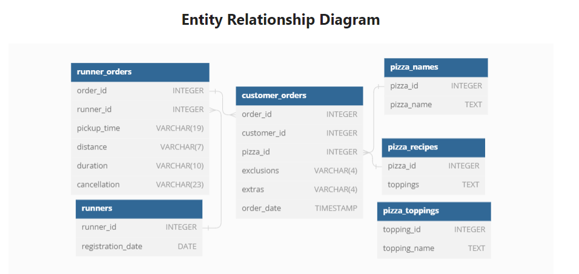
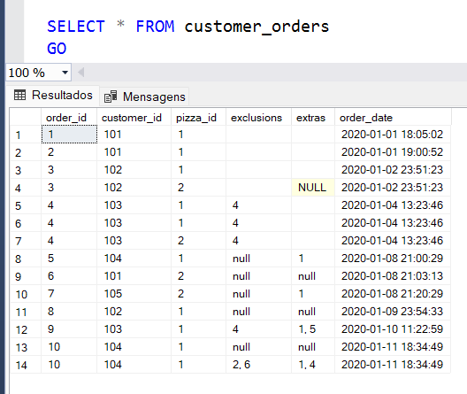
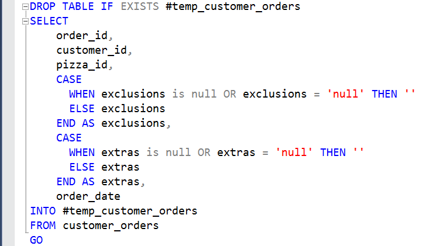
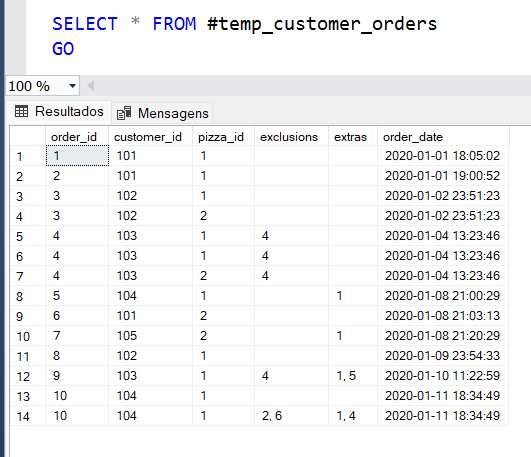
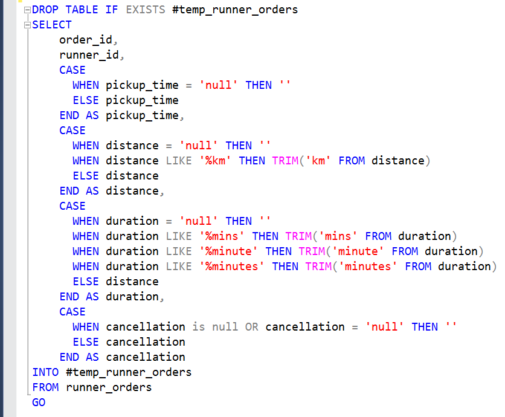
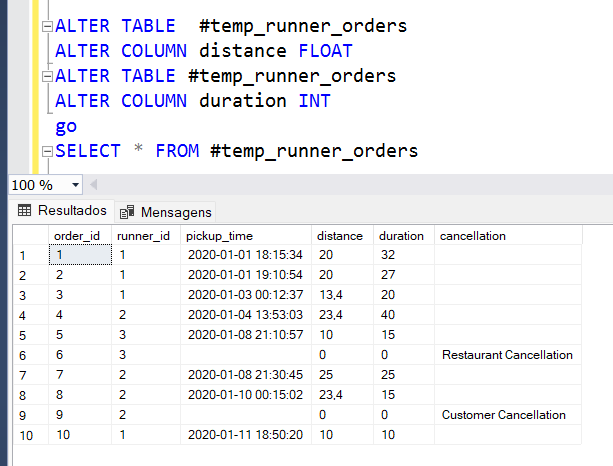

# Pizza Runner
## Desafio SQL - 2º Estudo de caso

  Dando continuidade ao desafio de 8 estudos de casos em 8 semanas, apresento o desenvolvimento do segundo estudo de caso, no qual são fornecidos dados sobre uma nova pizzaria, cujas entregas são realizadas por corredores. O gerenciador de Banco de Dandos escolhido para realização das consultas foi o SQL Server.
  O seguinte diagrama de entidade-relacionamento do seu banco de dados é fornecido, mas será necessário realizar o tratamento dos dados antes de analisar os dados que possam melhor orientar os  corredores e otimizar as operações do Pizza Runner. 
     

## Solução

  Antes de dar início as consultas é importante fazer uma inspeção dos dados para verificar se existe algum tipo de inconsistência que ocasionaria erro ao tentar recuperas as informações no banco de dados. Neste caso foram detectadas incoerências nos dados das tabelas customer_orders e runner_orders, portanto, o primeiro passo será a limpeza e tratamento dos dados.

### Tabela <i>customer_orders</i>
  

  As células em que os clientes não solicitam exclusões ou extras são representadas de maneira inconsistente. Elas podem ter o tipo de dados Nulo (ou seja, [NULL]), null como uma string (ou seja, [null]) ou podem ser deixadas em branco.Portanto, queremos adotar um único método de representação para as células que não possuem exclusões ou extras. Agora, como essas colunas são do tipo text e contêm strings, faz sentido representar uma célula sem exclusão ou extra como uma string vazia. 

  

  A ideia é criar uma tabela temporária, temp_customer_orders, que será uma cópia da nossa tabela original, customer_orders. A limpeza ou transformação dos dados será feita na tabela temporária, mantendo nossa tabela original intocada, para que tenhamos uma fonte de backup, caso seja necessário.

   
   
### Tabela <i>runner_orders</i>
   

  Ao inspecionar a tabela runner_orders, podemos identificar as seguintes questões:
  Primeiro iremos padronizar os valores das colunas distance, duration e cancelation, pois recebem tipo de valores diferentes. 
  

   Posteriormente, iremos modificar o tipo de dado para as colunas distance e duration que foram declaradas como varchar na criação da tabela, mas os tipos float e int seriam mais interessantes pois são caracteres númericos.
  Aplicada as alterações necessárias temos a tabela temp_runner_orders:

   

  Agora, após o tratamento dos dados podemos responder as questões propostas para a análise do negócio.

* **[A. Pizza Metrics](parte_A.md)**
* **[B. Runner and Customer Experience](parte_B.md)**
* **[C. Ingredient Optimisation](parte_C.md)**

## Link para o desafio

* **[Desafio](https://8weeksqlchallenge.com/case-study-2/)**

## Contato

  
  

