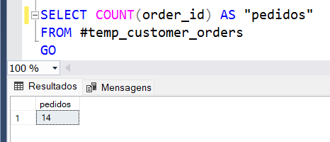
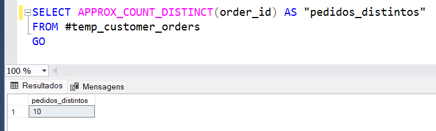
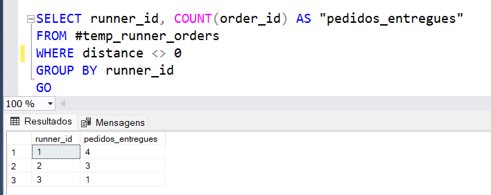
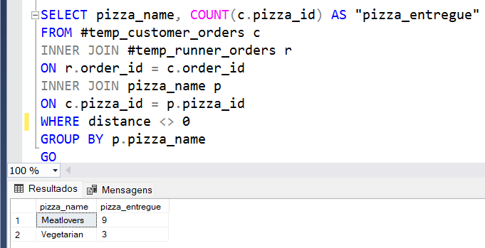
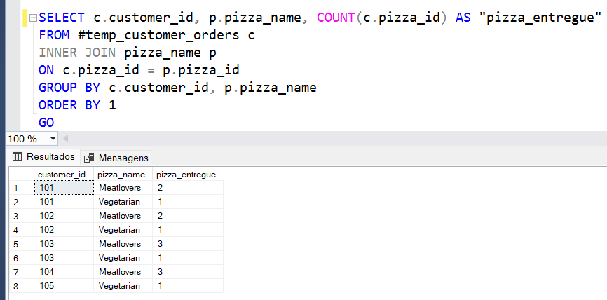
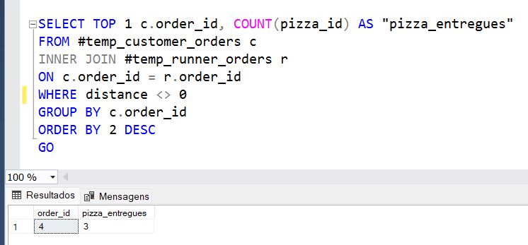
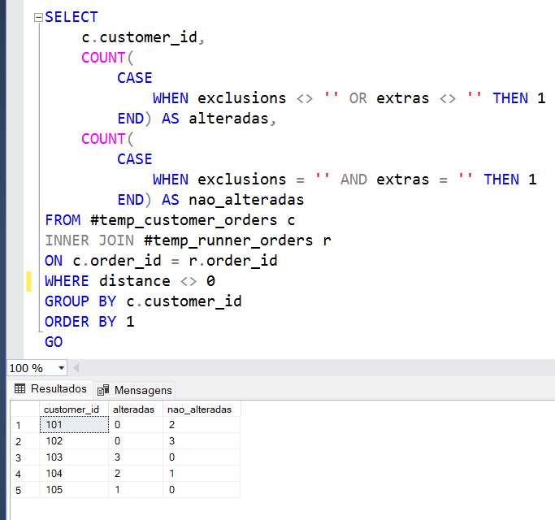
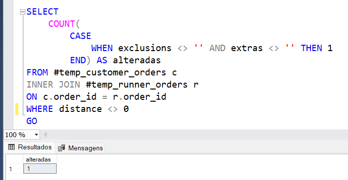
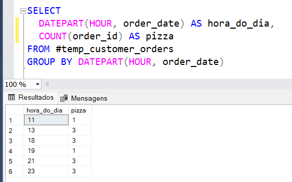
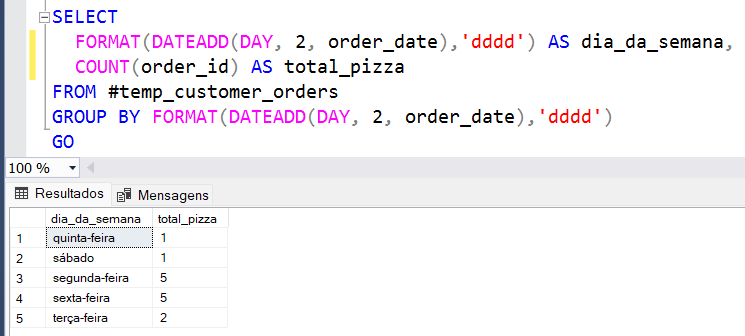

## A. Pizza Metrics

### 1.Quantas pizzas foram pedidas?

* Foram pedidas 14 pizzas

### 2.Pedidos distintos

* 10 pedidos distintos

### 3.Entregas bem sucedidas por cada entregador

* O entregador (runner_id = 1) teve 4 entregas, sendo o entregador com mais entregas bem sucedidas.
* O entregador (runner_id = 2) teve 3 entregas.
* O entregador (runner_id = 3) teve 1 entregas

### 4.Quantas pizzas de cada tipo foram entregues

* Foram entregues 9 pizzas do sabor Meatlovers
* E 3 pizzas vegetarianas

### 5. Quantas pizzas vegetarianas e quantas pizzas do sabor "Meatlovers" foram pedidas por cada cliente?

* Cliente(id=101): 2 pizzas sabor "Meatlovers" e 1 vegetariana
* Cliente(id=102): 2 pizzas sabor "Meatlovers" e 1 vegetariana
* Cliente(id=103): 3 pizzas sabor "Meatlovers" e 1 vegetariana
* Cliente(id=104): 3 pizzas sabor "Meatlovers"
* Cliente(id=105): 1 pizza vegetariana

### 6.Qual a quantidade máxima de pizza em um único pedido?

* 3 pizzas

### 7.Quantas pizzas tiveram alguma alteração e quantas não tiveram por cada cliente?

* Cliente(id=101): Não alterou nenhuma pizza
* Cliente(id=102): Não alterou nenhuma pizza
* Cliente(id=103): Alterou todas as pizzas pedidas
* Cliente(id=104): Alterou 2 pizzas e não alterou 1
* Cliente(id=105): Alterou a única pizza que pediu

### 8.Quantas pizzas tiveram alguma exlusão e alguma adição?

* Uma única pizza teve ambas alterações.

### 9.Total de pedidos realizados por hora?

* Às 13h, 18h, 21h, 23h a pizzaria recebeu 3 pedidos
* Às 11h e às 19h, receberam apenas 1 pedidos
* Não havendo pedidos em demais horários

### 10.Total de pedidos realizados por dia da semana?

* Segunda e sexta são os dias que a pizzaria recebe mais pedidos

##
**[Pizza Runner](pizza_runner.md)**  
**[Parte B](parte_B.md)**  
**[Parte C](parte_C.md)**

