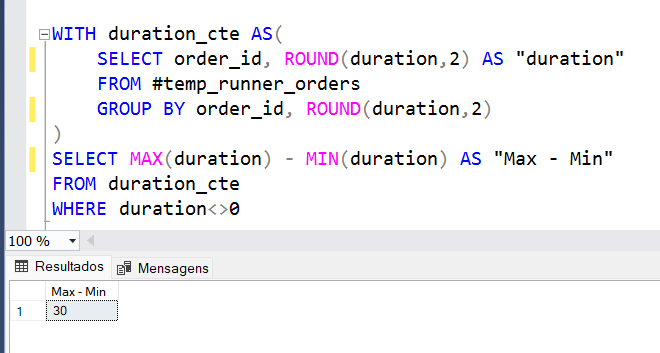

## B. Experiência dos Entregadores e Clientes

### 1.Quantos entregadores se cadastraram por semana?
É especificado dia 01 de janeiro de 2021, uma sexta-feira, deve ser considerado como o primeiro dia da semana.
Portanto, alteramos a contagem do início da semana que, por padrão do Microsoft SQL Server, é o domingo, 
para a sexta feira, como apresenta a tabela.

Alterado o primeiro dia da semana para a sexta-feira, temos:

* Na primeira semana de janeiro, 2 entregadores se cadastraram
* Na segunda semana de janeiro apenas 1 entregador se cadastrou, assim como na terceira semana.

### 2.Tempo médio que os entregadores levavam para pegar o pedido?

* O tempo médio é de 16 minutos

### Há alguma relação entre a quantidade de pizzas pedidas e o tempo de preparo?

* O pedido com o maior número de pizza, 3, também foi o com maior tempo de preparo, 30 minutos.
* O pedido que continha 2 pizzas levou 18 minutos e,
* O pedido que continha 1 pizza, 12.
* Podemos concluir que quanto mais pizzas, um maior tempo de preparo é necessário.
  
### 4.Distância média de deslocamento referente a cada cliente

* O cliente 105 está mais distante da pizzaria a 25km
* O cliente mais perto da pizzaria está a 10km, id 104.

### 5. Diferença entre o pedido que levou mais tempo e o que levou menos tempo para ser entregue

* A diferença entre a entrega mais rápida e a mais demoorada é 30 minutos.

### 6.Velocidade média de cada entregador

* O entregador 1 fez entregas com a velocidade variando entre 38km/h e 60km/h. Com uma velocidade média  de 46km/h.
* O entregador 2 fez uma entrega a 35km/h e outa a 60km/h. E em uma entrega, a velocidade foi de 94km/h extrapolando os valores médios.
* O 3º entregador só realizou uma corrida a 40km/h

##
**[Pizza Runner](pizza_runner.md)**  
**[Parte A ](parte_A.md)**  
**[Parte C](parte_C.md)**

