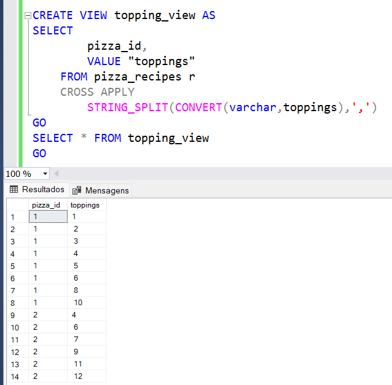
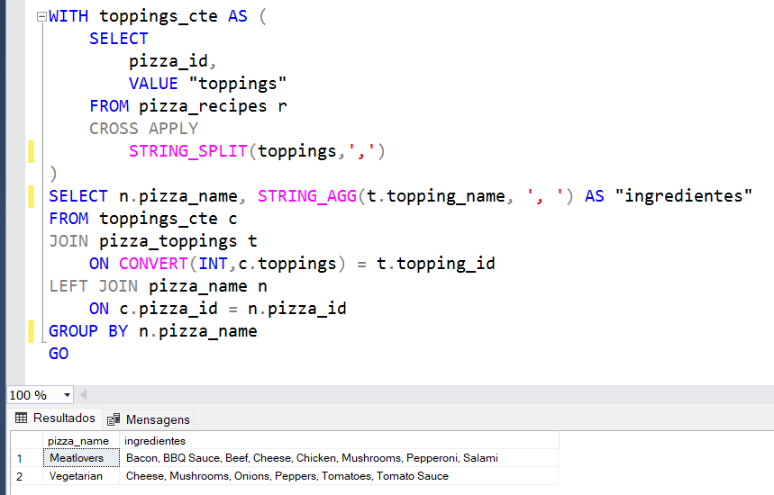
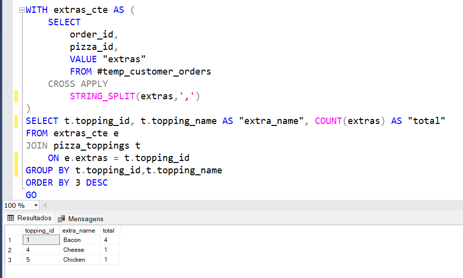
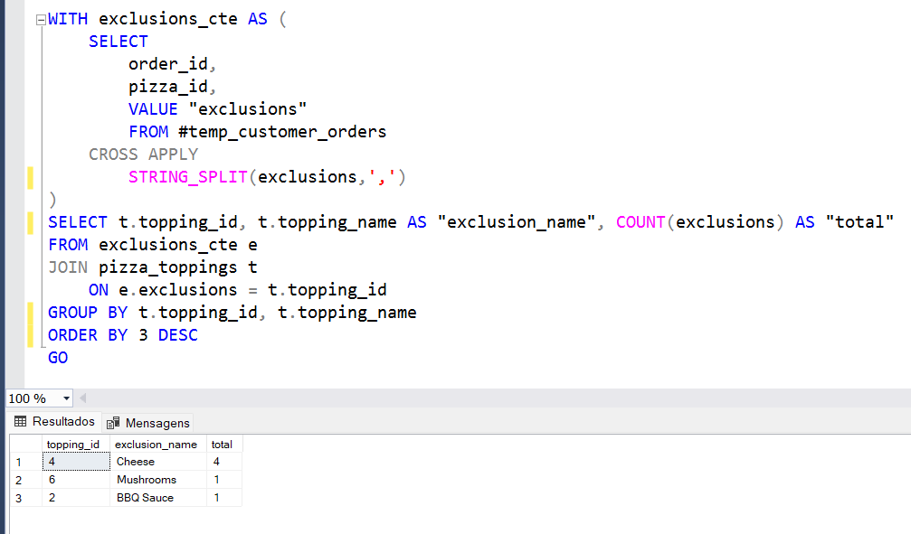

## C. Otimização dos Ingredientes

Para realizar as analises relacionadas aos ingredientes, primeiro será necessário criar uma View que transforme 
a coluna "topping" da tabela "pizza_recipes", que foi declarada como string.

### 1.Quais são os ingredientes de cada pizza por padrão?

* "Meatlovers": bacon, molho barbecue, bife, queijo, frango, cogumelos, peperoni e salami
* Vegetariana: queijo, cogumelos, cebola, pimenta, tomates e molho de tomate.

### 2.Acréscimo mais comum

* Bacon

### 3.Exclusão mais comum

* O queijo foi o ingrediente mais retirado das pizzas.

##
**[Pizza Runner](https://github.com/nadinne94/pizza_runner/blob/main/pizza_runner.md)**  
**[Parte A](https://github.com/nadinne94/parte_A.md)**  
**[Parte C](https://github.com/nadinne94/parte_C.md)**

